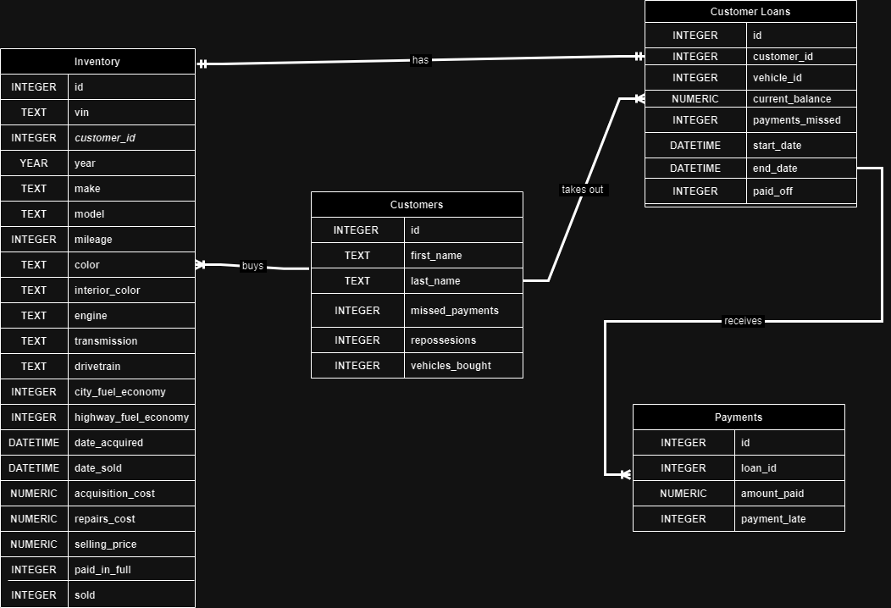

# CS50_SQL

For my CS50 SQL project, I decided to create a database modeling a car dealership. I got this idea from working as a Lot Attendant and Accounts Payable Clerk
for a small independent car dealership.

## Usage
Install SQLite3 for this project by following the instructions [Here](https://www.tutorialspoint.com/sqlite/sqlite_installation.htm).

Create a new database in SQLite. I named mine inventory.db or vehicles.db
```markdown
sqlite3 <database name> 
```

Read in the schema file
```markdown
.read schema.sql
.schema
```

You've created a new empty database with the schema, now feel free to add some vehicles and try out some queries from queries.sql!

ER Diagram:

## Academic Honesty 
Everyone taking CS50_SQL is allowed to upload their final projects to GitHub; you just can't upload problem sets. 

If you're currently taking this course **DO NOT** copy this code. Harvard will detect it and revoke your certificate.